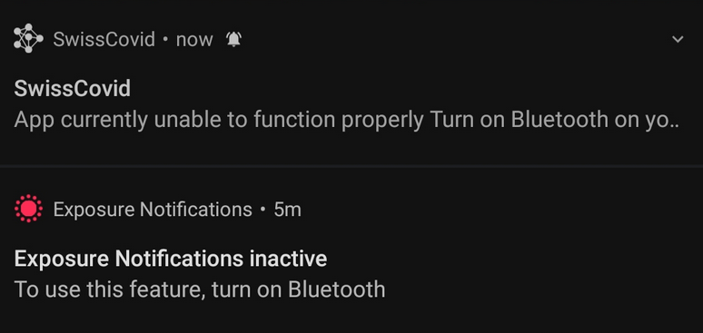

# Exposure Notification Monitor mit EPS32


Kurz vorweg, natürlich hätte man das ganze unter Android mit einer App, z.B. BeaconScope, oder unter Linux mit `bluetoothctl` machen könne. Ich spiele aber gerne mit den ESP's.

Da es aus meiner Sicht keine datenschutztechnischen Bedenken gibt die SwissCovid App zu verwenden, bin ich auch schon seit der öffentlichen Betapahse mit dabei und habe die Entwicklung rund um das Exposure Notification Framework von Apple und Google mitverfolgt. Das dezentrale Konzept ist sehr elegant und die App wurde transparent implementiert. Über die Genauigkeit der Distanzmessung via BLE, was ja eigentlich nur eine aproximation ist, muss man nicht diskutieren. Aber trotzdem finde ich die Lösung datensparsamer und datenschutzfreundlicher als die Lösungen so macher Gastrobetriebe.

Die iOS und Android App sowie das Backend und Dokumentation sind auf [Github verfügbar](https://github.com/DP-3T).

## Problem
Leider erscheint auf meinem Smartphone immer mal wieder die Meldung, das die SwissCovid App nicht funktioniert weil angeblich mein Bluetooth ausgeschaltet ist.



Ich denke, es hat was mit den "Akku Optimierungen" von OnePlus zu tun. Auch nachdem ich die App von der Akku Optimierungen ausgeschlossen habe, sehen ich diese Meldung ab und an mal.

Da ja die Exposure Notification auf Betriebssystemebene gemacht wird, vermute ich, dass es trotz dieser Meldung Funktioniert. 

## IDE
Entwicklungsumgebung ist VS Code mit der [PlatformIO](https://platformio.org/) Erweiterung.

## Verifikation und Implementierung
Über die Service UUID im Advertising Payload kann festgestellt werden ob es sich um ein Exposure Notification handelt. Die UUID ist in der [Spezifikation](https://www.blog.google/documents/62/Exposure_Notification_-_Bluetooth_Specification_v1.1.pdf) verfügbar und lautet `0xFD6F`.

Mit der [ESP32 BLE for Arduino](https://github.com/espressif/arduino-esp32/tree/master/libraries/BLE) Bibliothek und einem ESP32 kann sehr einfach ein scanner gebaut werden.

Im Monitor sieht man nun folgende Informationen (sofern ein sendendes Gerät in der Nähe ist):

```
MAC: 60:d5:30:cf:41:66 | RSSI: -88 
MAC: 4d:c8:8c:b7:6b:d1 | RSSI: -64 
Currently visible devices: 2
```
In meiner Umgebung senden aktuell zwei Geräte eine Exposure Notification aus. Das Gerät mit dem grösseren `RSSI` (-64) Wert ist mein Smartphone, da es näher am ESP32 liegt. Nun lasse ich mein Smartphone mal für eine längere Zeit unbenutzt liegen. Als beim entsperren die obige Meldung wieder angezeigt wurde, ich aber im Monitor kein zusätzliches Gerät gesehen habe, wusste ich, das die Exposure Notification trotz der obigen Meldung funktioniert.

Zusätzlich sieht man auch gut, das die Bluetooth MAC Adresse alle 15-20 Minuten gewechselt wird, um ein Tracking zu verhindern.

# Quellen
Das komplette Projekt ist auf Github [https://github.com/MrReSc/ExposureNotificationMonitor/tree/main](https://github.com/MrReSc/ExposureNotificationMonitor/tree/main) verfügbar.

Das Logo der SwissCovid App steht unter der Mozilla Public License Version 2.0 und stammt vom DP3T Projekt.